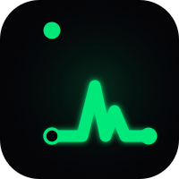
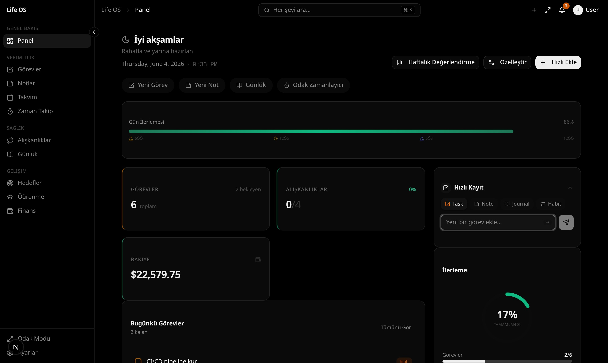
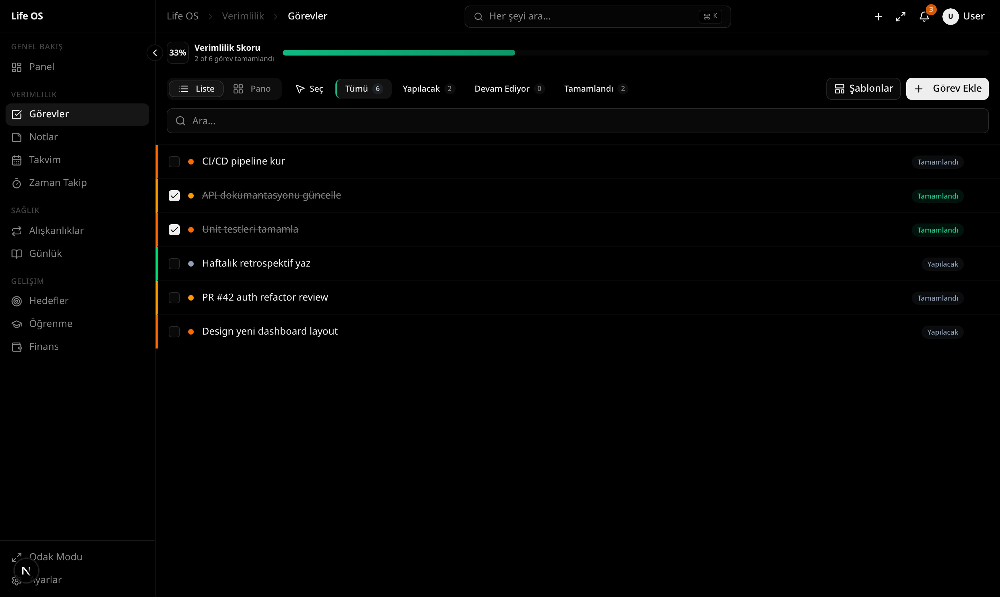
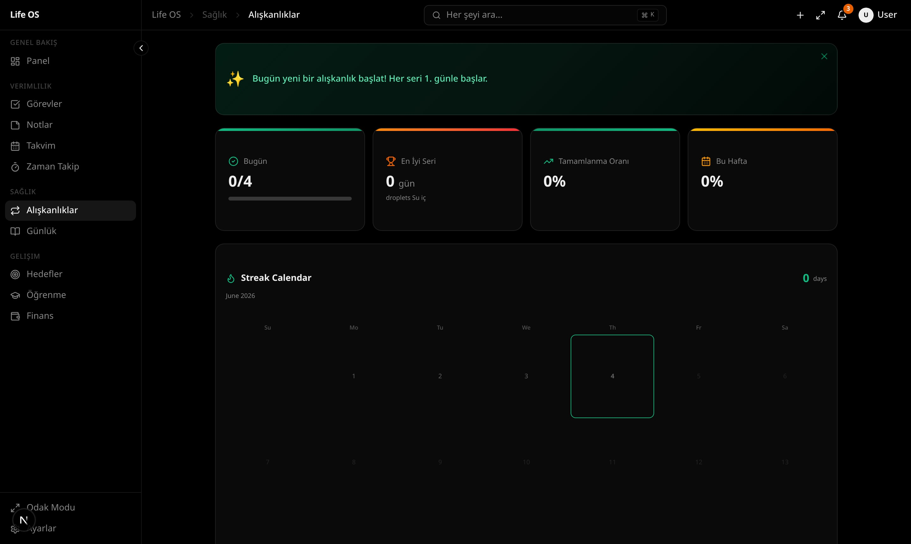
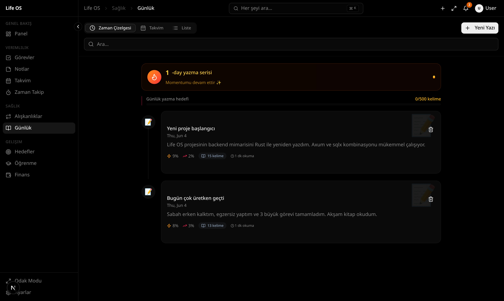
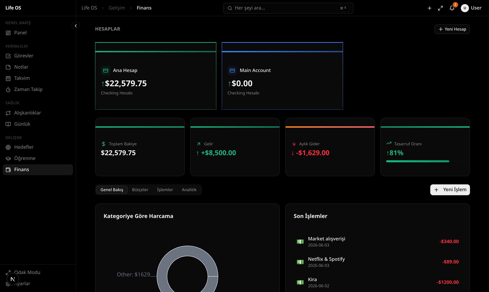

<div align="center">



# Life OS

**Your Personal Life Operating System**

[](https://github.com/lunanoir21/Life-os-project/actions/workflows/ci.yml)
[](https://nextjs.org/)
[](https://www.rust-lang.org/)
[](https://www.typescriptlang.org/)
[](LICENSE)

A beautiful, local-first personal life management system — tasks, habits, journal, finance, goals, and more in one place.

[Live Demo](https://lunanoir21.github.io/Life-os-project/) · [Documentation](https://lunanoir21.github.io/Life-os-project/documentation.html) · [Quick Start](#getting-started) · [Docker](#docker)

</div>

---

## Screenshots

| Dashboard | Tasks | Habits |
|:---------:|:-----:|:------:|
|  |  |  |

| Journal | Finance |
|:-------:|:-------:|
|  |  |

---

## Features

**11 modules** — Dashboard, Tasks, Notes, Habits, Journal, Finance, Goals, Learning, Calendar, Time Tracker, Settings

- Command palette (`⌘K`), global search, focus mode (`F11`)
- Drag-and-drop Kanban, recurring tasks, bulk operations
- Habit streaks with gap forgiveness, counter habits
- Finance budget alerts, CSV import, analytics charts
- Dashboard widget reordering (dnd-kit), real activity data
- Journal templates (Morning / Daily / Weekly)
- Pomodoro timer, time tracking with analytics
- Dark / Light / System theme + 10 accent colors + 8 variants
- Internationalization: EN, TR, ES, DE, FR
- Data export / import / reset

---

## Tech Stack

| Layer | Technology |
|-------|-----------|
| **Frontend** | Next.js 16 (App Router), React 19, TypeScript 5 |
| **Styling** | Tailwind CSS 4, shadcn/ui |
| **Backend** | Rust (axum 0.8 + sqlx 0.8) — replaces all Next.js API routes |
| **Database** | SQLite via Prisma (migrations) + sqlx (runtime queries) |
| **State** | Zustand (UI state) + TanStack Query (server state) |
| **Animations** | Framer Motion |
| **Charts** | Recharts |
| **Runtime** | Bun |
| **Container** | Docker — multi-stage build, standalone output |

### Architecture

Two processes run simultaneously:

```
Browser → Next.js :3000 → /api/* rewrites → Rust :8080 → SQLite
```

Next.js serves the UI and proxies every `/api/*` request to the Rust backend. There are no Next.js API route handlers.

---

## Getting Started

### Development

**Prerequisites:** Bun, Rust (stable toolchain)

```bash
git clone https://github.com/lunanoir21/Life-os-project.git
cd Life-os-project

# Install frontend dependencies
bun install

# Set up the database
bun run db:push
bun run db:generate

# Seed with demo data (optional)
bun run db:seed
```

Then start both processes in separate terminals:

```bash
# Terminal 1 — Rust backend (port 8080)
bun run backend:dev

# Terminal 2 — Next.js frontend (port 3000)
bun run dev
```

Open [http://localhost:3000](http://localhost:3000).

### Docker — single command, every platform

```bash
# One command does it all: checks Docker, builds, starts, waits healthy, tails logs.
# Works on Linux, macOS, Windows (PowerShell / CMD) and WSL.
bun run docker:start

# If you don't have Node/Bun yet, use the no-deps shell wrappers:
./start.sh          # Linux / macOS / WSL
./start.ps1         # Windows PowerShell

# Stop / reset
bun run docker:stop          # stop, keep the data volume
bun run docker:reset         # stop AND delete the data volume (DATA LOSS)
```

The app will be available at [http://localhost:3000](http://localhost:3000).
SQLite data is persisted to the `life-os-data` named volume between restarts.

### Environment Variables

| Variable | Default | Purpose |
|----------|---------|---------|
| `DATABASE_URL` | `sqlite:../prisma/dev.db` | SQLite path for Rust backend |
| `BACKEND_URL` | `http://localhost:8080` | Used by Next.js rewrites |
| `PORT` | `8080` | Rust backend listen port |
| `API_KEY` | _(unset)_ | If set, all `/api/*` requests must carry `Authorization: Bearer <key>` |
| `ALLOWED_ORIGIN` | _(unset)_ | If set, CORS is restricted to this origin |

---

## Scripts

| Script | Description |
|--------|-------------|
| `bun run dev` | Next.js dev server on :3000 |
| `bun run build` | Production build (standalone output) |
| `bun run typecheck` | TypeScript type check |
| `bun run lint` | ESLint |
| `bun run test` | Vitest (jsdom) |
| `bun run backend:dev` | Rust backend (cargo run) |
| `bun run backend:build` | Rust release build |
| `bun run db:push` | Apply schema to dev.db |
| `bun run db:generate` | Regenerate Prisma client |
| `bun run db:seed` | Populate dev.db with demo data |
| `bun run docker:start` | **One-command launch** (cross-platform: detect → build → up → wait → tail logs) |
| `bun run docker:stop` | Stop containers, keep the data volume |
| `bun run docker:reset` | Stop AND delete the data volume (destructive) |
| `bun run docker:up` | Raw `docker compose up -d --build` |
| `bun run docker:logs` | Raw `docker compose logs -f` |
| `bun run docker:down` | Raw `docker compose down` |
| `./start.sh` / `./start.ps1` | Shell wrappers (no Node/Bun required) |

---

## Project Structure

```
life-os/
├── backend/                   # Rust backend (axum + sqlx)
│   ├── src/
│   │   ├── main.rs            # Entry point, env config
│   │   ├── lib.rs             # Router + AppState
│   │   ├── db.rs              # SQLite pool setup
│   │   ├── error.rs           # AppError → HTTP response
│   │   └── *.rs               # One file per module (tasks, habits, …)
│   └── tests/                 # Integration tests (tempfile SQLite)
├── prisma/
│   ├── schema.prisma          # Database schema (Prisma manages migrations)
│   ├── migrations/            # SQL migration files
│   └── seed.ts                # Demo data seeder
├── src/
│   ├── app/                   # Next.js App Router (layout + page only)
│   ├── components/lifeos/     # One subdirectory per module
│   ├── lib/api/               # TanStack Query hooks + fetch client
│   ├── lib/i18n/              # Translations (EN, TR, ES, DE, FR)
│   └── stores/                # Zustand UI state stores
├── docs/
│   ├── index.html             # GitHub Pages landing page
│   └── screenshots/           # App screenshots
├── Dockerfile                 # Multi-stage: Rust → Next.js → runtime
├── docker-compose.yml
└── docker-entrypoint.sh       # Migrate → wait for backend → start frontend
```

---

## Keyboard Shortcuts

| Shortcut | Action |
|----------|--------|
| `⌘K` / `Ctrl+K` | Command Palette |
| `⌘F` / `Ctrl+F` | Global Search |
| `F11` | Focus Mode |
| `⌘/` / `Ctrl+/` | Toggle Theme |
| `?` | Keyboard Shortcuts Help |
| `Escape` | Close dialogs |

---

## License

MIT — see [LICENSE](LICENSE).

---

<div align="center">

[Back to top](#life-os)

</div>
